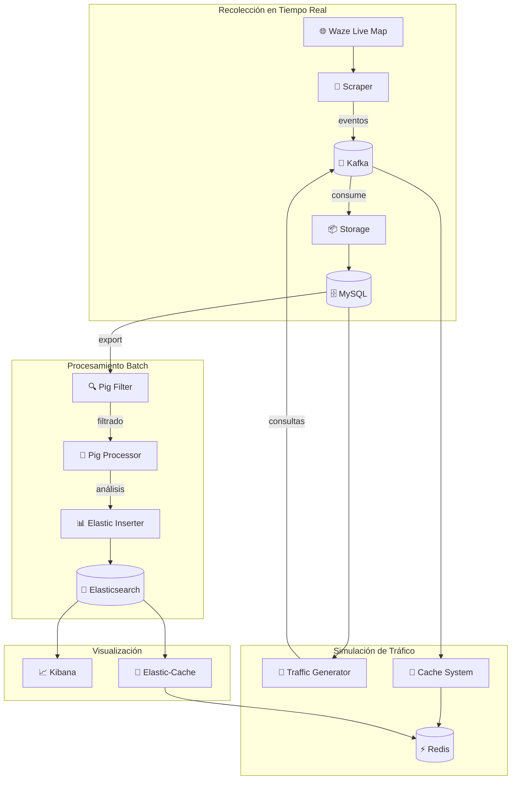
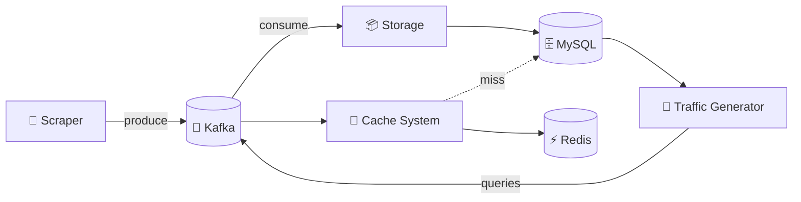
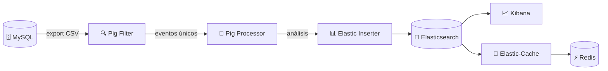

# 🚦 TrafficMesh - Plataforma Distribuida para Monitoreo de Tráfico en Tiempo Real

Plataforma distribuida para la recolección, procesamiento y análisis en tiempo real de datos de tráfico urbano de la Región Metropolitana de Chile, utilizando fuentes públicas como Waze Live Map.

[](https://deepwiki.com/TheRamdomX/TrafficMesh)
[](https://www.docker.com/)
[](https://kafka.apache.org/)
[](https://www.python.org/)
[](https://www.selenium.dev/documentation/webdriver/)
[](https://www.mysql.com/)
[](https://redis.io/)
[](https://pig.apache.org/)
[](https://www.elastic.co/)
[](https://www.elastic.co/kibana)

---

## � Tabla de Contenidos

- [Descripción General](#-descripción-general)
- [Arquitectura del Sistema](#-arquitectura-del-sistema)
- [Parte 1: Recolección y Almacenamiento](#-parte-1-sistema-de-recolección-y-almacenamiento)
- [Parte 2: Procesamiento y Análisis](#-parte-2-sistema-de-procesamiento-y-análisis)
- [Tecnologías](#-tecnologías)
- [Quick Start](#-quick-start)
- [Estructura del Proyecto](#-estructura-del-proyecto)

---

## 🎯 Descripción General

**TrafficMesh** es un sistema completo de Big Data que combina:

- **Streaming en tiempo real** con Kafka y Redis
- **Procesamiento batch** con Apache Pig
- **Almacenamiento persistente** en MySQL y Elasticsearch
- **Visualización de datos** con Kibana
- **Simulación de cargas** para pruebas de rendimiento de caché

### Tipos de Eventos Detectados

| Tipo | Descripción |
|------|-------------|
| 🚧 CAMINO CORTADO | Vías bloqueadas o cerradas |
| ⚠️ PELIGRO | Condiciones peligrosas en la vía |
| 👮 POLICIA | Controles o presencia policial |
| 💥 ACCIDENTE | Colisiones vehiculares |
| 🚗 CONGESTION | Tráfico lento o atascado |

---

## 🏗 Arquitectura del Sistema

### Flujo de Datos Completo



---

## 📦 Parte 1: Sistema de Recolección y Almacenamiento

### Componentes

| Componente | Descripción | Funcionamiento |
|------------|-------------|----------------|
| 🧠 **Scraper** | Web scraping de Waze | Divide la RM en 2025 cuadrantes (45x45), usa 15 threads con Selenium para extraer eventos, identifica comunas con GeoJSON |
| 📦 **Storage** | Persistencia de eventos | Consume de Kafka y almacena en MySQL (timestamp, lat, lon, tipo, comuna) |
| 🎯 **Traffic Generator** | Simulador de consultas | Genera consultas con distribución uniforme y logarítmica (Zipf) para testing de caché |
| 🧊 **Cache System** | Sistema de caché dual | Implementa políticas LRU y Random con Redis como backend |

### Diagrama de Arquitectura



### Servicios - Parte 1

| 🌐 Servicio          | 🔢 Puerto | 📝 Descripción              |
|---------------------|-----------|------------------------------|
| 🧭 Zookeeper         | 2181      | Coordinación de Kafka        |
| 💬 Kafka             | 9092      | Broker de mensajes           |
| 🗄️ MySQL             | 3306      | Base de datos relacional     |
| ⚡ Redis             | 6379      | Sistema de caché distribuido |
| 🧠 Scraper           | -         | Extracción de datos de Waze  |
| 📦 Storage           | -         | Almacenamiento de eventos    |
| 🎯 Traffic Generator | -         | Generador de consultas       |
| 🧊 Cache System      | -         | Cache con políticas híbridas |

---

## 📦 Parte 2: Sistema de Procesamiento y Análisis

### Componentes

| Componente | Descripción | Funcionamiento |
|------------|-------------|----------------|
| 🔍 **Pig Filter** | Eliminación de duplicados | Detecta eventos duplicados por proximidad (<11m) y tiempo (<5min) usando Apache Pig |
| 🐷 **Pig Processor** | Análisis estadístico | Genera análisis por comuna, tipo de evento y distribución horaria |
| 📊 **Elastic Inserter** | Carga a Elasticsearch | Convierte resultados de Pig y los indexa con mappings geoespaciales |
| 🧊 **Elastic-Cache** | Cache con Elasticsearch | Sistema de caché que usa Elasticsearch como fuente de datos |

### Diagrama de Arquitectura



### Servicios - Parte 2

| 🌐 Servicio | 🔢 Puerto | 📝 Descripción |
|-------------|-----------|----------------|
| 🔎 Elasticsearch | 9200 | Motor de búsqueda y análisis |
| 📈 Kibana | 5601 | Visualización de datos |
| 🔍 Pig Filter | - | Filtrado de duplicados con Apache Pig |
| 🐷 Pig Processor | - | Procesamiento y análisis de eventos |
| � Elastic Inserter | - | Carga de datos a Elasticsearch |
| 🧊 Elastic-Cache | - | Cache con backend Elasticsearch |

### Análisis Generados

#### 1. 📍 Análisis por Comuna
- Total de eventos por comuna
- Cantidad de tipos distintos de eventos
- Desglose detallado por tipo y comuna

#### 2. ⏰ Análisis Temporal
- Distribución de eventos por hora del día (0-23h)
- Patrones temporales por tipo de evento
- Identificación de horas pico

#### 3. 🔄 Filtrado de Duplicados
- Eliminación de eventos a menos de ~11 metros
- Filtrado de eventos en ventana de 5 minutos
- Reducción de redundancia en los datos

---

## 🛠 Tecnologías

| Categoría | Tecnología | Uso |
|-----------|------------|-----|
| **Mensajería** | Apache Kafka | Streaming de eventos entre componentes |
| **Coordinación** | Zookeeper | Gestión de cluster Kafka |
| **Web Scraping** | Selenium + Chrome | Extracción de datos de Waze |
| **Base de Datos** | MySQL 8.0 | Almacenamiento persistente |
| **Caché** | Redis | Cache de alto rendimiento |
| **Procesamiento** | Apache Pig | ETL y análisis batch |
| **Búsqueda** | Elasticsearch 8.11 | Indexación y búsqueda de eventos |
| **Visualización** | Kibana 8.11 | Dashboards y exploración de datos |
| **Geoespacial** | GeoPandas + Shapely | Identificación de comunas |
| **Contenedores** | Docker Compose | Orquestación de servicios |

---

## 🚀 Quick Start

```bash
# Clonar el repositorio
git clone https://github.com/TheRamdomX/TrafficMesh.git
cd TrafficMesh

# Levantar todos los servicios
docker-compose up --build

# O en modo detached
docker-compose up -d --build
```

### Acceso a Servicios

| Servicio | URL |
|----------|-----|
| Kibana | http://localhost:5601 |
| Elasticsearch | http://localhost:9200 |
| MySQL | localhost:3306 |
| Redis | localhost:6379 |

---

## 📁 Estructura del Proyecto

```
TrafficMesh/
├── 📄 docker-compose.yml      # Orquestación de servicios
├── 📄 README.md               # Documentación
│
├── 🧠 Scraper/                # Web scraping de Waze
│   ├── scraper.py             # Script principal (15 threads)
│   ├── RM.geojson             # Polígonos de comunas RM
│   └── Dockerfile
│
├── 📦 Storage/                # Persistencia en MySQL
│   ├── storage.py             # Consumidor Kafka → MySQL
│   └── Dockerfile
│
├── 🎯 Trafic/                 # Generador de consultas
│   ├── traffic_generator.py   # Distribuciones uniforme/log
│   └── Dockerfile
│
├── 🧊 Cache/                  # Sistema de caché (Kafka)
│   ├── cache_system.py        # LRU + Random + Redis
│   └── Dockerfile
│
├── 🔍 Filter/                 # Filtrado de duplicados
│   ├── filter_events.pig      # Script Apache Pig
│   ├── init.sh                # Export MySQL → CSV
│   └── Dockerfile
│
├── 🐷 Pig/                    # Procesamiento y análisis
│   ├── process_events.pig     # Análisis comuna/hora
│   ├── export_events.sh       # Preparación de datos
│   └── Dockerfile
│
├── 📊 Elastic/                # Inserción a Elasticsearch
│   ├── Insert.py              # Carga de datos e índices
│   └── Dockerfile
│
└── 🧊 Elastic-Cache/          # Cache con Elasticsearch
    ├── cache_system.py        # LRU + Random + ES
    └── Dockerfile
```

